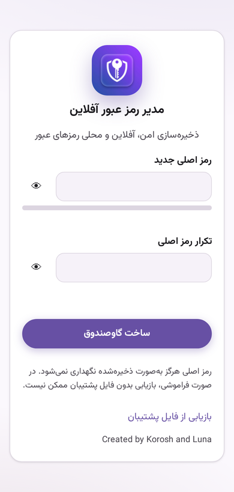
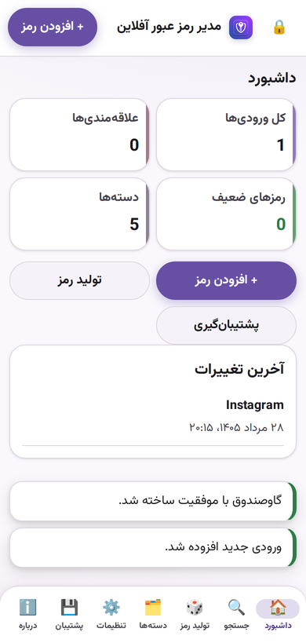
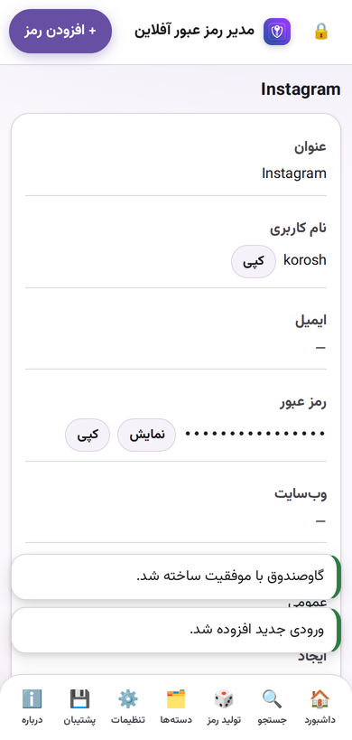
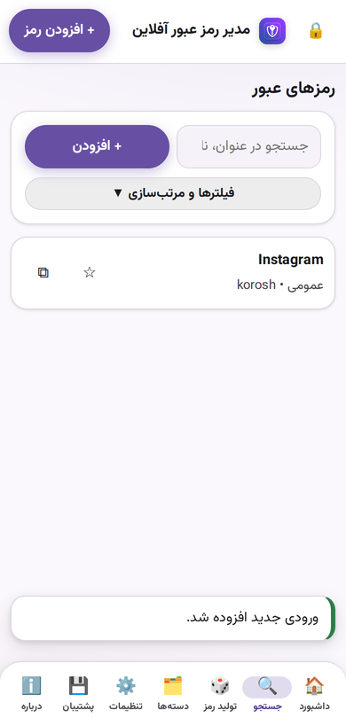
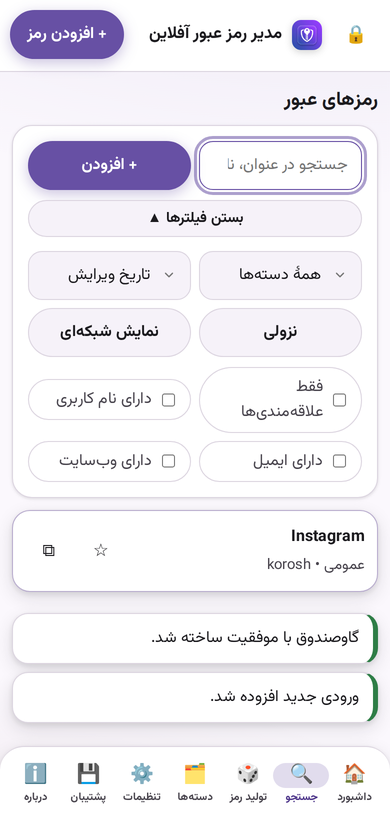
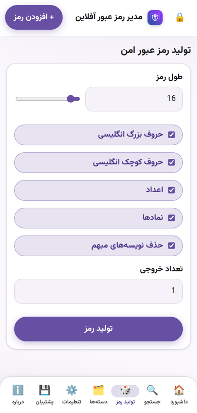
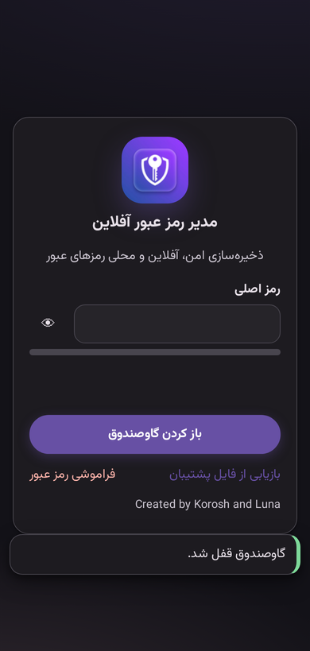
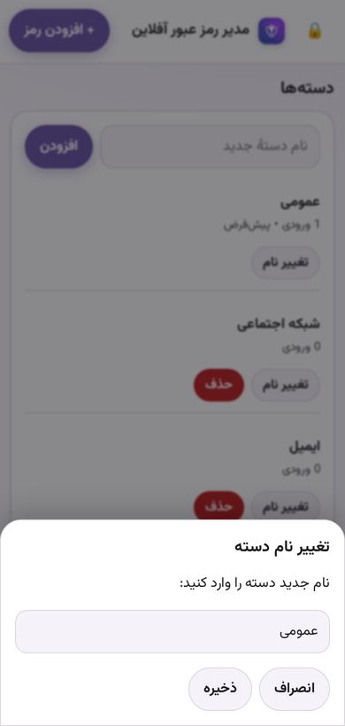

# 📱 مستندات کامل اپلیکیشن «مدیر رمز عبور آفلاین» — نسخهٔ اندروید

> نسخهٔ فعلی: **1.0.3** (versionCode 4) — Android 10 تا 16 — همهٔ پردازندهها — کاملاً آفلاین
> Created by Korosh and Luna 💜

## پیش‌نمایش رابط

















این سند **تمام کدها و تمام اجزای اپلیکیشن** را از صفر تا صد توضیح میدهد؛ از فایلهای Gradle و منیفست گرفته تا تکبهتک توابع هستهٔ HTML (رمزارز، دیتابیس، روتر، رابط کاربری و پلهای بومی).

---

## ۱. معماری کلی

اپلیکیشن دو لایه دارد:

```
┌─────────────────────────────────────────────────────────┐
│  لایهٔ بومی (Native) — Java                                │
│  MainActivity.java  : شل WebView + مدیریت چرخهٔ حیات       │
│  BackupBridge.java  : ذخیرهٔ فایل پشتیبان بدون مجوز         │
│  res/               : آیکون، تم، استرینگها                 │
├─────────────────────────────────────────────────────────┤
│  لایهٔ وب (Web) — assets/Index.html                       │
│  CSS  : ظاهر + تم تیره/روشن + طراحی ریسپانسیو موبایل/دسکتاپ │
│  JS   : رمزنگاری AES-256-GCM + PBKDF2، IndexedDB،          │
│         روتر هش، فرمها، تولید رمز، پشتیبانگیری، قفل خودکار   │
└─────────────────────────────────────────────────────────┘
```

**مزیت این معماری:** کل منطق برنامه (رمزارز، دیتابیس، UI) یک بار در HTML نوشته شده و بین دو پلتفرم (اندروید و ویندوز/Electron) مشترک است. فقط لایهٔ نازک بومی هر پلتفرم متفاوت است. چون هیچ کتابخانهٔ نیتیو (`.so`) وجود ندارد، APK روی **همهٔ پردازندهها** (ARM، ARM64، x86، x86_64) نصب میشود.

---

## ۲. ساختار کامل پروژه

```
passman-android/
├── README-سورس.md                  ← راهنمای ساخت (این فایل)
├── settings.gradle                 ← مخازن و نام پروژه
├── build.gradle                    ← پلاگین AGP 8.10.1
├── gradle.properties               ← تنظیمات حافظه/داemon
├── gradlew / gradlew.bat           ← Gradle Wrapper 8.13
├── gradle/wrapper/…                ← jar + properties ورژن Gradle
├── keystore.properties.example     ← الگوی امضا (فایل واقعی gitignore است)
├── keystore/README.md              ← ساخت کلید محلی — هیچ کلید/رمزی در گیت نیست
├── app/
│   ├── build.gradle                ← تنظیمات اندروید + امضا + ورژن
│   └── src/main/
│       ├── AndroidManifest.xml
│       ├── assets/Index.html       ← ★ هستهٔ کل اپلیکیشن
│       ├── java/com/korosh/offlinepasswordmanager/
│       │   ├── MainActivity.java
│       │   └── BackupBridge.java
│       └── res/
│           ├── drawable/ic_launcher_background.xml
│           ├── layout/activity_main.xml
│           ├── mipmap-*/…          ← آیکونها در ۵ تراکم
│           ├── mipmap-anydpi-v26/… ← آیکون تطبیقی اندروید 8+
│           └── values/{strings,colors,styles}.xml
└── screenshots/                    ← پیشنمایش رابط
```

---

## ۳. فایلهای Gradle

### 3.1 `settings.gradle`
```groovy
pluginManagement {
    repositories { google(); mavenCentral(); gradlePluginPortal() }
}
dependencyResolutionManagement {
    repositoriesMode.set(RepositoriesMode.FAIL_ON_PROJECT_REPOS)
    repositories { google(); mavenCentral() }
}
rootProject.name = "passman-android"
include ':app'
```
- پلاگینها (AGP) و وابستگیها فقط از مخازن رسمی Google و Maven Central دانلود میشوند؛ حالت `FAIL_ON_PROJECT_REPOS` از تعریف مخزن غیرمجاز داخل ماژول جلوگیری میکند.
- تنها ماژول پروژه `:app` است.

### 3.2 `build.gradle` (ریشه)
```groovy
plugins { id 'com.android.application' version '8.10.1' apply false }
```
ورژن پلاگین اندروید را در ریشه قفل میکند تا در ماژول فقط `apply` شود.

### 3.3 `gradle.properties`
```properties
org.gradle.jvmargs=-Xmx3g -Dfile.encoding=UTF-8
org.gradle.daemon=false
org.gradle.parallel=true
org.gradle.caching=false
android.useAndroidX=false
```
- حداکثر ۳ گیگ رم برای JVM گریدل، انکودینگ UTF-8 برای اسمهای فارسی.
- `useAndroidX=false`: پروژه هیچ وابستگی اندرویدایکس ندارد (صفر وابستگی!) و از کلاسهای قدیمی `android.app.Activity` استفاده میکند.

### 3.4 `app/build.gradle`
```groovy
android {
    namespace 'com.korosh.offlinepasswordmanager'
    compileSdk 36
    defaultConfig {
        applicationId 'com.korosh.offlinepasswordmanager'
        minSdk 29          // اندروید 10
        targetSdk 36       // اندروید 16
        versionCode 3
        versionName '1.0.2'
    }
    signingConfigs {
        release {
            // فقط اگر keystore.properties محلی وجود داشته باشد پر می‌شود
            // رمز و مسیر کلید هرگز در سورس نیستند
        }
    }
    buildTypes {
        release {
            minifyEnabled false
            shrinkResources false
            signingConfig signingConfigs.release
        }
        debug { applicationIdSuffix '.debug' }
    }
    compileOptions {
        sourceCompatibility JavaVersion.VERSION_17
        targetCompatibility JavaVersion.VERSION_17
    }
    lint { checkReleaseBuilds false; abortOnError false }
}
```
| تنظیم | توضیح |
|---|---|
| `minSdk 29` | حداقل اندروید 10 — پایینتر نصب نمیشود |
| `targetSdk 36` | سازگاری کامل با اندروید 16 (شامل قوانین Predictive Back) |
| `signingConfigs.release` | امضا فقط از `keystore.properties` محلی (gitignore) خوانده می‌شود |
| `minifyEnabled false` | حذف R8 عمداً غیرفعال است (APK فقط ~۵۰۰KB است و WebView با کدهای فشردهشدهٔ HTML مشکلی ندارد) |
| `applicationIdSuffix '.debug'` | بیلد debug جدا نصب میشود و با release تداخل ندارد |

---

## ۴. `AndroidManifest.xml`

```xml
<manifest xmlns:android="http://schemas.android.com/apk/res/android">
    <!-- بدون هیچ uses-permission: حتی INTERNET هم ندارد -->
    <application
        android:allowBackup="false"
        android:fullBackupContent="false"
        android:icon="@mipmap/ic_launcher"
        android:roundIcon="@mipmap/ic_launcher_round"
        android:label="@string/app_name"
        android:supportsRtl="true"
        android:usesCleartextTraffic="false"
        android:hardwareAccelerated="true"
        android:theme="@style/AppTheme">
        <activity
            android:name=".MainActivity"
            android:exported="true"
            android:configChanges="orientation|screenSize|screenLayout|keyboardHidden|uiMode|smallestScreenSize|density|locale|layoutDirection"
            android:windowSoftInputMode="adjustResize">
            <intent-filter>
                <action android:name="android.intent.action.MAIN" />
                <category android:name="android.intent.category.LAUNCHER" />
            </intent-filter>
        </activity>
    </application>
</manifest>
```

| عنصر | چرا |
|---|---|
| **صفر `uses-permission`** | برنامه هیچ مجوزی نمیگیرد — حتی INTERNET. یعنی در سطح سیستمعامل هم قادر به اتصال شبکه نیست. |
| `allowBackup="false"` | از بکاپ adb/Google جلوگیری میکند تا دادهٔ رمزنگاریشده هم بیرون دستگاه نرود. |
| `usesCleartextTraffic="false"` | حتی اگر کدی HTTP درخواست کند، مسدود میشود. |
| `configChanges="…"` | چرخش صفحه و تغییر تم، Activity را از نو نمیسازد (WebView و حالت قفل برنامه حفظ میشود). |
| `windowSoftInputMode="adjustResize"` | با باز شدن کیبورد، WebView کوچک میشود تا فرم دیده شود. |
| `exported="true"` | لازم برای لانچر (قانون اندروید 12+). |

---

## ۵. `MainActivity.java` — شل بومی

### ۵.۱ فیلدها و ثابتها
```java
private static final String ASSET_URL = "file:///android_asset/Index.html";
private static final int REQUEST_OPEN_BACKUP = 1001;
private FrameLayout rootContainer;
private WebView webView;
private ValueCallback<Uri[]> pendingFileChooserCallback;
```
- برنامه از آدرس `file:///android_asset/Index.html` بارگذاری میشود — یعنی **کاملاً از داخل APK و بدون شبکه**.
- `REQUEST_OPEN_BACKUP` کد درخواست بازگشتی برای انتخاب فایل پشتیبان است.
- `pendingFileChooserCallback` نتیجهٔ فایلچوزر را به WebView برمیگرداند (برای `<input type="file">`).

### ۵.۲ `onCreate()`
1. `setContentView(R.layout.activity_main)` و پیدا کردن `rootContainer` (فریم خالی).
2. `createWebView()` — ساخت WebView بهصورت برنامهای (بهجای XML) تا در صورت کرش قابل بازسازی باشد.
3. **اندروید 13+:** ثبت `registerOnBackInvokedCallback` برای ژست برگشت پیشبینیشده (Predictive Back که در targetSdk 36 اجباری است):
```java
getOnBackInvokedDispatcher().registerOnBackInvokedCallback(
    OnBackInvokedDispatcher.PRIORITY_DEFAULT, this::handleBack);
```

### ۵.۳ `createWebView()` — تنظیمات WebSettings
```java
settings.setJavaScriptEnabled(true);          // اجرای هستهٔ JS برنامه
settings.setDomStorageEnabled(true);          // localStorage
settings.setDatabaseEnabled(true);            // IndexedDB
settings.setUseWideViewPort(true);            // عرض = عرض صفحه
settings.setLoadWithOverviewMode(true);       // عدم بزرگنمایی اولیه
settings.setSupportZoom(false);               // بدون زوم (حالت اپلیکیشن)
settings.setSupportMultipleWindows(false);    // بدون popup داخلی
settings.setSafeBrowsingEnabled(false);       // بدون تماس با سرور گوگل
settings.setAllowFileAccess(true);            // خواندن assets از file://
```

### ۵.۴ `setWebViewClient` — امنیت شبکه
```java
shouldOverrideUrlLoading(...) {
    if (http/https) { openExternal(url); return true; }   // → مرورگر سیستم
    return false;
}
shouldInterceptRequest(...) {
    if (http/https) return new WebResourceResponse("text/plain","utf-8", new ByteArrayInputStream(new byte[0]));
    // ↑ هر درخواست شبکه داخل WebView با پاسخ خالی BLOCK میشود (لایهٔ دوم آفلاین بودن)
}
onRenderProcessGone(...) {
    rootContainer.removeView(view); webView.destroy(); createWebView();
    // ↑ اگر اندروید پروسهٔ رندر را بکشد (رم کم)، برنامه خودش را خودکار بازسازی میکند
}
```

### ۵.۵ `setWebChromeClient` — لینک خارجی و انتخاب فایل
```java
onCreateWindow(...) {
    // لینک target=_blank وبسایتِ ورودی → مرورگر سیستم، هرگز داخل برنامه
    WebView.HitTestResult hit = view.getHitTestResult();
    if (hit != null && hit.getExtra() شروع با http/https) openExternal(url);
}
onShowFileChooser(...) {
    // باز کردن پنجرهٔ بومی انتخاب فایل (برای بازیابی پشتیبان)
    Intent(ACTION_OPEN_DOCUMENT) + CATEGORY_OPENABLE
    type = "*/*"  و  EXTRA_MIME_TYPES = json / octet-stream / text
    startActivityForResult(intent, REQUEST_OPEN_BACKUP);
}
```

### ۵.۶ پل جاوااسکریپت
```java
webView.addJavascriptInterface(new BackupBridge(this), "AndroidBridge");
```
داخل HTML با `window.AndroidBridge.saveTextFile(...)` قابل صدا زدن است.

### ۵.۷ بقیهٔ متدها
| متد | کار |
|---|---|
| `handleBack()` | اگر تاریخچهٔ WebView عقبی دارد → `goBack()`، وگرنه بستن Activity |
| `onBackPressed()` | اندروید ≤12 همان `handleBack`؛ در 13+ سیستم خودش dispatcher را صدا میزند |
| `openExternal(url)` | باز کردن لینک با `ACTION_VIEW` در مرورگر پیشفرض |
| `onActivityResult()` | تحویل فایل انتخابشده به `pendingFileChooserCallback` |
| `onPause/onResume` | تعلیق/ازسرگیری WebView (ثبات و صرفهجویی انرژی) |
| `onDestroy()` | حذف و نابودی WebView |

---

## ۶. `BackupBridge.java` — ذخیرهٔ پشتیبان بدون مجوز

متد اصلی:
```java
@JavascriptInterface
public String saveTextFile(String filename, String text, String mime) { … }
```

**چطور کار میکند (MediaStore — بدون هیچ مجوزی):**
1. یک `ContentValues` با `DISPLAY_NAME` (نام فایل)، `MIME_TYPE` و `RELATIVE_PATH = "Download/OfflinePasswordManager"` میسازد.
2. با `resolver.insert(MediaStore.Downloads.EXTERNAL_CONTENT_URI, values)` رکورد میسازد.
3. محتوای متنی را با `openOutputStream` مینویسد (UTF-8).
4. `IS_PENDING` را از 1 به 0 تغییر میدهد تا فایل برای سایر برنامهها نمایان شود.

**خروجی:** رشتهٔ JSON مثل `{"ok":true,"name":"password-backup.json"}` که هستهٔ HTML میخواند.

> چرا MediaStore؟ از اندروید 10 به بعد، نوشتن مستقیم در حافظهٔ عمومی نیازمند مجوز است؛ MediaStore بدون مجوز کار میکند و فایل در پوشهٔ `دانلودها/OfflinePasswordManager/` ظاهر میشود.

توابع کمکی: `jsonResult(ok, message)` (ساخت JSON خروجی) و `escape(value)` (پاکسازی کوتیشنها برای جلوگیری از شکستن JSON).

---

## ۷. منابع (`res/`)

| فایل | توضیح |
|---|---|
| `layout/activity_main.xml` | یک `FrameLayout` با `id=root` و `fitsSystemWindows=true` (WebView برنامهای داخلش اضافه میشود) |
| `values/strings.xml` | نام برنامه: «مدیر رمز عبور آفلاین» |
| `values/colors.xml` | رنگ پسزمینهٔ پنجره `#F5F6FA` (همرنگ تم روشن HTML تا هنگام لود فلش نزند) |
| `values/styles.xml` | تم `Theme.Material.Light.NoActionBar` با نوار وضعیت روشن |
| `drawable/ic_launcher_background.xml` | گرادیان بنفش→آبی (`#FF913CFB → #FF4A4AC2 → #FF2D50AC`) از رنگهای آیکون شما |
| `mipmap-anydpi-v26/*.xml` | **آیکون تطبیقی** (Adaptive Icon) اندروید 8+: پسزمینهٔ گرادیان + فورگراند آیکون شما |
| `mipmap-{mdpi…xxxhdpi}/*.png` | آیکونهای معمولی (مربع، گرد و فورگراند) در ۵ تراکم — برای اندرویدهای قدیمیتر و قالبهای خاص |

آیکونها با پایتون/Pillow از `icon.png` آپلودشدهٔ شما تولید شدهاند.

---

## ۸. `assets/Index.html` — هستهٔ کل اپلیکیشن

این فایل (~۳۰۰KB و ~۳۸۰۰ خط) کل برنامه است. بخش به بخش:

### ۸.۱ `<head>` — امنیت و هویت
| مورد | مقدار / توضیح |
|---|---|
| `viewport` | `width=device-width, initial-scale=1, maximum-scale=1, user-scalable=no, viewport-fit=cover` — رفتار اپلیکیشنی (بدون زوم ناخواسته) + دسترسی به safe-area |
| **CSP** | `default-src 'self' blob: data:; script-src 'self' 'unsafe-inline'; style-src 'self' 'unsafe-inline'; img-src 'self' data: blob:; font-src 'self' data:; object-src 'none'; frame-src 'none'; base-uri 'none'; form-action 'none'` — هیچ منبع خارجی مجاز نیست |
| فونت | **وزیرمتن** (Regular + Bold) بهصورت base64 داخل فایل — در همهٔ گوشیها و ویندوز 7 هم یکسان و خوانا |
| favicon | آیکون شما بهصورت data-URI |

### ۸.۲ CSS — سیستم طراحی
- **متغیرهای تم** در `:root` (روشن) و `[data-theme="dark"]`: رنگ اصلی، پسزمینه، سطح، متن، خط، خطر، موفقیت، هشدار، شعاع 16px.
- **اندازهٔ قلم** سهحالته از طریق `html[data-font=…]` (کوچک/متوسط/بزرگ).
- **مؤلفهها:** کارت، دکمه (پایه/اصلی/خطر/کوچک)، ورودی، چیپ فیلتر، لیست ورودیها (فهرستی/شبکهای)، کارت آمار، ردیف جزئیات، ردیف تنظیمات، نوار قدرت رمز (۵ سطح رنگی)، توست، دیالوگ، تبهای ناوبری.
- **`@media (max-width:900px)`** — حالت موبایل: نوار تبها به پایین منتقل میشود (Bottom Bar) با سایه و گوشهٔ گرد + `env(safe-area-inset-bottom)`.
- **`@media (max-width:700px)`** — گوشی باریک: فرمها تکستونه، آمار دوتایی، دیالوگها **Bottom Sheet** (چسبیده به پایین)، لوگو کوچکتر.
- **`@media (prefers-reduced-motion)`** — حذف انیمیشن برای کاربران حساس به حرکت.
- **`[data-platform="android"]`** — تنظیمات مخصوص اندروید (عرض نوار تبها مساوی، چیدمان فیلترها تاشو و…).
- **توجه:** هیچ `color-mix()` استفاده نمیشود (در Chromium 108 و WebViewهای قدیمی پشتیبانی نمیشود — باگ «دکمههای سفید» نسخهٔ قبلی از همین بود).

### ۸.۳ ماژولهای جاوااسکریپت

#### 🔹 تشخیص پلتفرم
```js
const IS_ANDROID = typeof window.AndroidBridge !== 'undefined' || /android/i.test(navigator.userAgent);
if (IS_ANDROID) document.documentElement.dataset.platform = 'android';
```
اندروید بودن از وجود پل `AndroidBridge` یا User-Agent تشخیص داده میشود و کل CSS/UI بر اساس آن تنظیم میشود.

#### 🔹 `CONSTANTS`
نام برنامه، نام دیتابیس (`offline-password-manager-db`)، کلید store، **تعداد تکرار PBKDF2 = 310,000**، شناسهٔ فرمت پشتیبان و ورژن گاوصندوق.

#### 🔹 `Utils` — ابزارهای پایه
| تابع | کار |
|---|---|
| `bufToBase64 / base64ToUint8` | تبدیل باینری↔Base64 (برای ذخیرهٔ salt/IV/دادهٔ رمزشده) |
| `randomBytes(n)` | بایت تصادفی امن از `crypto.getRandomValues` |
| `uuid()` | شناسهٔ یکتا (با فالبک دستی برای موتورهای قدیمی) |
| `formatDate()` | تاریخ شمسی با `Intl.DateTimeFormat('fa-IR')` |
| `clamp / debounce` | محدودهسازی اعداد و تأخیر ورودی جستجو |
| `sanitizeText / sanitizeNotes / sanitizeUrl / sanitizeFilename` | پاکسازی همهٔ ورودیها (XSS-مقاوم — همهچیز با textContent رندر میشود) |
| `readFileAsText(file)` | خواندن فایل پشتیبان انتخابشده |
| **`download(filename, text, mime)`** | ذخیرهٔ پشتیبان با **سه استراتژی**: ① `electronAPI` (ویندوز) ② **`AndroidBridge` (اندروید)** ③ فالبک مرورگر (بلاب + لینک دانلود) |

#### 🔹 کمکیهای DOM
- `isPlainObject / cloneDeep / mergeDeep` — مدیریت آبجکت تنظیمات.
- `getPath / setPath` — دسترسی با مسیر نقطهای (مثل `generator.length`).
- **`h(tag, attrs, children)`** — سازندهٔ المان DOM (معادل سبکوزن JSX). همهٔ UI با همین تابع ساخته میشود و متنها همیشه `textContent` میشوند (ضد XSS).

#### 🔹 `DEFAULT_SETTINGS` + `SettingsManager`
تنظیمات پیشفرض: تم (سیستم/تیره/روشن)، رنگ اصلی، اندازهٔ قلم، انیمیشن، حالت نمایش (فهرستی/شبکهای)، صفحهٔ شروع، دستهٔ پیشفرض، نام فایل پشتیبان، پاکسازی کلیپبورد (ثانیه)، قفل خودکار (دقیقه)، قفل هنگام پسزمینه، تأیید عملیات حساس، تنظیمات تولید رمز و جستجو.
- ذخیره در `localStorage` (غیرحساس بودن تنظیمات).
- `apply()` تم/قلم/انیمیشن/رنگ را روی `document.documentElement` اعمال میکند.

#### 🔹 `DB` — ذخیرهسازی
رَپر IndexedDB با استور `kv`؛ با **فالبک حافظهای** اگر IndexedDB در دسترس نباشد (داده در آن حالت فقط تا پایان نشست میماند و به کاربر هشدار داده میشود).

#### 🔹 `CryptoManager` — رمزارز ⭐
- **قالب پاکت (Envelope):** `{version, cipher:'AES-GCM', kdf:{name:'PBKDF2', hash:'SHA-256', iterations, saltB64}, ivB64, dataB64}`
- `deriveKey(password, salt, iterations)` — مشتق کلید: PBKDF2-SHA-256 → کلید AES-256.
- `encryptEnvelope / decryptEnvelope` — رمز/گشایی کامل با salt تصادفی ۱۶ بایتی و IV تصادفی ۱۲ بایتی.
- `isValidEnvelope()` — اعتبارسنجی ساختاری قبل از هر گشایی.
- `reEncryptEnvelope()` — رمزنگاری مجدد با کلید جاری (بدون PBKDF2 دوباره) در هر ذخیرهٔ گاوصندوق.
- رمز اصلی **هرگز ذخیره نمیشود**؛ فقط کلید مشتقشده در حافظهٔ نشست میماند.

#### 🔹 `COMMON_PASSWORDS` + `PasswordStrength`
لیست رمزهای رایج (فارسی و انگلیسی) + الگوریتم امتیازدهی ۰ تا ۴: طول (۸/۱۲/۱۶/۲۴)، تنوع کلاس نویسهها (کوچک/بزرگ/رقم/نماد/فارسی)، جریمه برای تکرار و دنباله (123, abc, qwe…)، صفر کردن امتیاز برای رمزهای رایج و تکراری. خروجی: `{score, label, percent}` برای نوار قدرت.

#### 🔹 `PasswordGenerator`
تولید رمز امن: انتخاب نویسه با **rejection sampling** (`secureRandomInt`) برای توزیع یکنواخت، تضمین حضور حداقل یک نویسه از هر کلاس انتخابشده، حذف نویسههای مبهم (`Il1O0oB8S5Z2`) و درهمریزی Fisher-Yates.

#### 🔹 مدل داده
- `createDefaultCategories()` — ۵ دستهٔ پیشفرض: عمومی، شبکه اجتماعی، ایمیل، بانک، کار.
- `createEmptyVault()` — گاوصندوق خالی با ورژن و تاریخ.
- `validateVault(data)` — اعتبارسنجی و نرمالسازی کامل گاوصندوق پس از گشایی (شناسههای تکراری، دستههای نامعتبر، پاکسازی فیلدها، تضمین وجود دستهٔ «عمومی»).

#### 🔹 `App` — وضعیت سراسری
```js
state: { initialized, hasVault, corrupted, locked, vault, ui:{q, sortKey, sortDir, category, onlyFavorites, hasUsername, hasEmail, hasWebsite} }
session: { key, envelope }        // کلید رمزنگاری فقط در حافظه
lastActivity / hiddenAt / clipboardToken
```

#### 🔹 `VaultManager`
| متد | کار |
|---|---|
| `create(password)` | ساخت گاوصندوق جدید و ذخیرهٔ پاکت رمزشده |
| `unlock(password)` | گشایی پاکت، اعتبارسنجی، ورود به نشست |
| `lock()` | پاککردن گاوصندوق و کلید از حافظه |
| `persist()` | رمزنگاری مجدد + نوشتن در IndexedDB (در هر تغییر) |
| `changeMasterPassword(current, new)` | گشایی با رمز فعلی → رمزنگاری با رمز جدید |

#### 🔹 `BackupManager`
- `createBackup(password, filename)` — ساخت پشتیبان با رمز مستقل، قالب: `{app, backupVersion, exportedAt, envelope}` و ذخیره از طریق پل بومی.
- `parseBackupFile(file)` — اعتبارسنجی کامل فایل (شناسهٔ برنامه، ورژن، ساختار پاکت).
- `applyBackup(backup, password)` — جایگزینی گاوصندوق فعلی.

#### 🔹 CRUD ورودیها و دستهها
`addEntry / updateEntry / deleteEntry / duplicateEntry / toggleFavorite` و `addCategory / renameCategory / deleteCategory` — همه با sanitize قبل از ذخیره و `persist()` بعد از تغییر.

#### 🔹 اعتبارسنجی و خطاها
- `validateMasterPassword()` — حداقل ۸ نویسه، رد رمزهای رایج/تکراری، حداقل امتیاز قدرت.
- `validateEntryData()` — عنوان اجباری، فرمت ایمیل، فقط http/https برای آدرس.
- `userErrorMessage()` — ترجمهٔ همهٔ کدهای خطای داخلی به فارسی.

#### 🔹 `toast()` و `Dialog`
- توست: پیام موقت با نوع (info/success/error) در پایین صفحه.
- دیالوگ: مبتنی بر `<dialog>` با `showModal` و backdrop؛ `confirm()` (تأیید/انصراف) و `prompt()` (ورودی متنی) — در موبایل بهصورت Bottom Sheet.

#### 🔹 `copySensitive(text, label)`
کپی در کلیپبورد با فالبک `execCommand`؛ طبق تنظیمات، بعد از N ثانیه کلیپبورد را خالی میکند (توکن محافظ برای جلوگیری از پاکشدن کپی جدیدتر).

#### 🔹 قفل خودکار `setupAutoLock()`
- گوشدادن به رویدادهای فعالیت کاربر (`pointerdown/keydown/…`) و بهروزرسانی `lastActivity`.
- تایمر ۵ ثانیهای: اگر مدت عدمفعالیت از `autoLockMinutes` گذشت → قفل.
- `visibilitychange`: رفتن به پسزمینه با تنظیم `lockWhenHidden` → قفل بعد از مدت تنظیمشده.
- `pagehide`: پاککردن کلید و گاوصندوق از حافظه هنگام بستن.
- موقع قفل، کلیپبورد هم پاک میشود.

#### 🔹 روتر هش
- `parseHash()` — تجزیهٔ `#/path?query`.
- `renderRoute(route)` — جدول مسیرها:
  | مسیر | صفحه |
  |---|---|
  | `/dashboard` | داشبورد (آمار + آخرین تغییرات) |
  | `/search` و `/passwords` و `/favorites` | فهرست جستجو (با فوکوس خودکار) |
  | `/passwords/new` | فرم افزودن |
  | `/passwords/:id` و `/passwords/:id/edit` | جزئیات / ویرایش |
  | `/generator` | تولید رمز |
  | `/categories` | مدیریت دستهها |
  | `/settings` | تنظیمات |
  | `/backup` و `/restore` | پشتیبانگیری/بازیابی |
  | `/about` | درباره |
- `renderCurrent()` — تصمیم مرکزی: اگر داده خراب → صفحهٔ بازیابی؛ اگر قفل → صفحهٔ قفل؛ وگرنه پوستهٔ اصلی.

#### 🔹 `renderAppShell` — ناوبری
```js
const navItems = [ داشبورد🏠، جستجو🔍، تولید رمز🎲، دستهها🗂️، تنظیمات⚙️، پشتیبان💾، دربارهℹ️ ]
  .filter(item => !(item.path === '/passwords' || item.path === '/favorites'));
```
- تبهای «رمزها» و «علاقهمندیها» **حذف شدهاند** چون جستجو همان کار را با فیلتر انجام میدهد (خواستهٔ کاربر).
- در موبایل: ۷ تب آیکوندار با عرض **مساوی** در نوار پایین (مثل Bottom Navigation متریال).
- در دسکتاپ: آیکونها `display:none` میشوند (ویندوز 7 ایموجی ندارد).
- مسیرهای قدیمی `/passwords` و `/favorites` هنوز کار میکنند و به صفحهٔ جستجو هدایت میشوند (سازگاری با بوکمارک/تاریخچه).

#### 🔹 صفحهٔ قفل و «فراموشی رمز عبور» 🔑
```js
hasVault ? h('button', { class: 'link-danger', onClick: … }, ['فراموشی رمز عبور']) : null
```
فلو: دیالوگ تأیید («ما فقط میتوانیم دادهها را برای امنیت پاک کنیم…») → با «بله، پاک کن»:
1. `await DB.deleteItem('vault')` — حذف گاوصندوق رمزنگاریشده.
2. ریست کامل `App.state` و `App.session`.
3. `SettingsManager.resetAll()` — تنظیمات هم به پیشفرض برمیگردد.
4. پاککردن کلیپبورد + توست موفقیت.
5. رندر مجدد → فرم «ساخت گاوصندوق» با رمز جدید.
> اگر گاوصندوقی وجود نداشته باشد (اولین اجرا)، گزینه نمایش داده نمیشود.

#### 🔹 `init()` — راهاندازی
1. بررسی وجود `crypto.subtle` (در غیر این صورت صفحهٔ خطای مهلک).
2. راهاندازی دیالوگ، تنظیمات، دیتابیس.
3. خواندن وضعیت گاوصندوق (`refreshVaultExistence`) و تشخیص دادهٔ خراب.
4. ثبت روتر، قفل خودکار، واکنش به تغییر تم سیستم.
5. رندر اولیه.

---

## ۹. سناریوهای کاربر (End-to-End)

| سناریو | مسیر کد |
|---|---|
| **ساخت گاوصندوق** | فرم قفل → اعتبارسنجی رمز → `VaultManager.create` → `encryptEnvelope` (salt+PBKDF2 310k → AES-GCM) → ذخیره در IndexedDB → داشبورد |
| **ورود** | `VaultManager.unlock` → `decryptEnvelope` → `validateVault` → داشبورد؛ رمز اشتباه → پیام خطا |
| **افزودن رمز** | فرم → sanitize → `addEntry` → `persist()` (رمزنگاری مجدد) |
| **جستجو/فیلتر** | `getFilteredEntries` — جستجوی متنی + فیلتر دسته/علاقهمندی/نامکاربری/ایمیل/وبسایت + مرتبسازی |
| **تولید رمز** | `PasswordGenerator.generateMultiple` با گزینهها → کپی با پاکسازی خودکار |
| **پشتیبانگیری** | `BackupManager.createBackup` → `Utils.download` → `AndroidBridge.saveTextFile` → `دانلودها/OfflinePasswordManager/` |
| **بازیابی** | `<input type="file">` → فایلچوزر بومی → `parseBackupFile` → تأیید → `applyBackup` |
| **فراموشی رمز** | دکمهٔ قرمز روی صفحهٔ قفل → دیالوگ → حذف گاوصندوق → شروع از اول |
| **قفل خودکار** | تایمر عدمفعالیت / رفتن به پسزمینه → `lockNow` → پاککردن حافظه و کلیپبورد |

---

## ۱۰. مدل امنیتی (خلاصهٔ کامل)

| لایه | مکانیزم |
|---|---|
| رمزنگاری | AES-256-GCM (رمزنگاری اصالتدار) — کلید از PBKDF2-SHA-256 با **۳۱۰٬۰۰۰ تکرار** و salt تصادفی ۱۶ بایتی |
| رمز اصلی | هیچجا ذخیره نمیشود؛ فقط کلید مشتقشده در RAM نشست |
| داده | فقط در IndexedDB خصوصی برنامه (غیرقابل دسترس سایر اپها) |
| شبکه | ① بدون مجوز INTERNET در منیفست ② بلاک همهٔ درخواستها در `shouldInterceptRequest` ③ CSP بدون منابع خارجی ④ `usesCleartextTraffic=false` |
| لینکها | فقط در مرورگر سیستم باز میشوند، هرگز داخل WebView |
| تزریق کد | متنها همیشه `textContent`؛ ورودیها sanitize؛ `addJavascriptInterface` فقط یک متد محدود (saveTextFile) |
| بکاپ سیستم | `allowBackup=false` |
| کلیپبورد | پاکسازی خودکار پس از N ثانیه |
| فراموشی رمز | تنها راه: پاککردن کامل داده (چون رمزنگاری واقعی است — دور زدنی وجود ندارد) |

---

## ۱۱. بیلد، امضا و نسخهها

```bash
./gradlew assembleRelease        # خروجی: app/build/outputs/apk/release/app-release.apk
```
- امضا: فقط با کلید محلی که در `keystore.properties` تعریف می‌کنید (نگاه کنید به `keystore/README.md`). کلید قبلی مخزن **افشا شده و نباید استفاده شود**.

### تاریخچهٔ نسخهها
| نسخه | versionCode | تغییرات |
|---|---|---|
| 1.0.0 | 1 | انتشار اولیه (هستهٔ HTML + شل WebView + پشتیبانگیری MediaStore) |
| 1.0.1 | 2 | بازطراحی موبایل: حذف تبهای تکراری از اندروید، پنل فیلتر تاشو، دیالوگ Bottom-Sheet، تاچتارگت ۴۸px، safe-area، بازیابی خودکار رندر |
| 1.0.2 | 3 | رفع باگ «دکمههای سفید بیمتن» (حذف color-mix ناسازگار با WebView قدیمی)، حذف تبهای تکراری از هر دو پلتفرم، حذف ایموجی دسکتاپ، تقسیم مساوی تبها، برچسب «رمزساز» |
| 1.0.2+ | 3 | افزودن «فراموشی رمز عبور» به صفحهٔ ورود (بدون تغییر ورژن طبق درخواست) |

---

## ۱۲. عیبیابی رایج

| مشکل | راهحل |
|---|---|
| «مسدود شده توسط Play Protect» / نصب از منابع ناشناس | به فایلمنیجر یا تنظیمات اجازهٔ نصب APK بدهید (برنامه امضای فروشگاهی ندارد) |
| آپدیت نصب نمیشود («بسته با امضای متفاوت») | فایل با کلید اصلی ساخته شده؛ اگر خودتان بیلد کردهاید keystore را عوض نکرده باشید |
| دادهها بعد از حذف دیتای برنامه پاک شد | طبیعی است (IndexedDB خصوصی برنامه) — همیشه پشتیبان JSON بگیرید |
| فایل پشتیبان پیدا نمیشود | در `دانلودها/OfflinePasswordManager/` بگردید |
| رمز اصلی فراموش شده | گزینهٔ «فراموشی رمز عبور» (پاککردن) یا «بازیابی از فایل پشتیبان» اگر پشتیبان دارید |

---

## ۱۳. توسعهٔ آینده (پیشنهادی)

- پشتیبانی از اثر انگشت/بیومتریک برای باز کردن سریع (BiometricPrompt + Keystore اندروید برای نگهداری امن کلید).
- رمزنگاری لایهٔ دوم با Android Keystore برای گاوصندوق (علاوه بر PBKDF2).
- خروجی AAB برای انتشار در گوگلپلی (با همین سورس فقط `bundleRelease`).
- همگامسازی دستی از طریق فایل بین دستگاهها (کاملاً آفلاین).

---
Created by Korosh and Luna 💜 — تمام کدها با دقت تستشده روی شبیهساز WebView و روی پلتفرم دسکتاپ.
